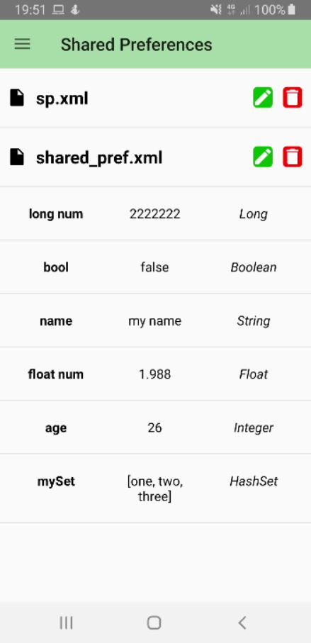
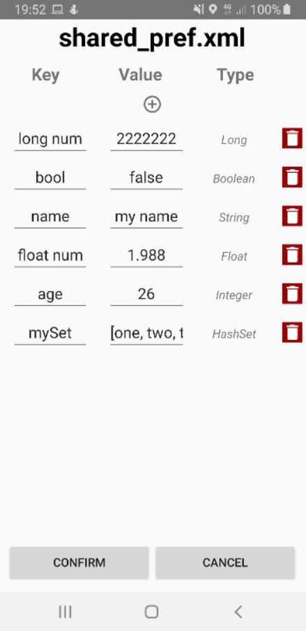
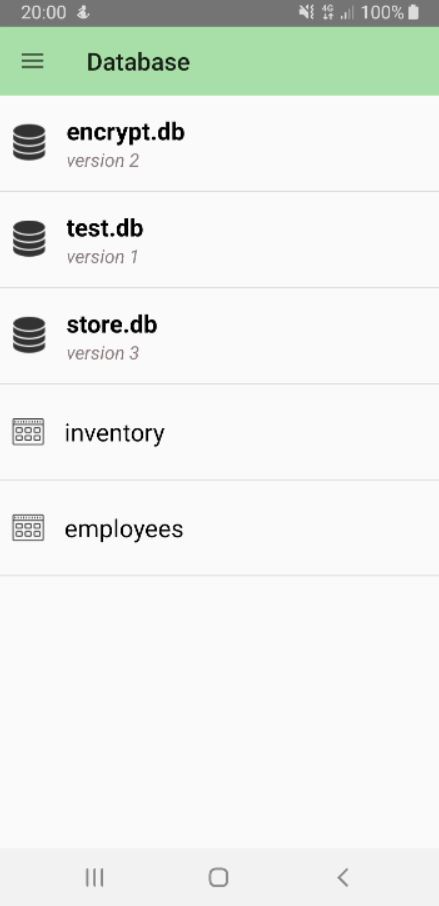
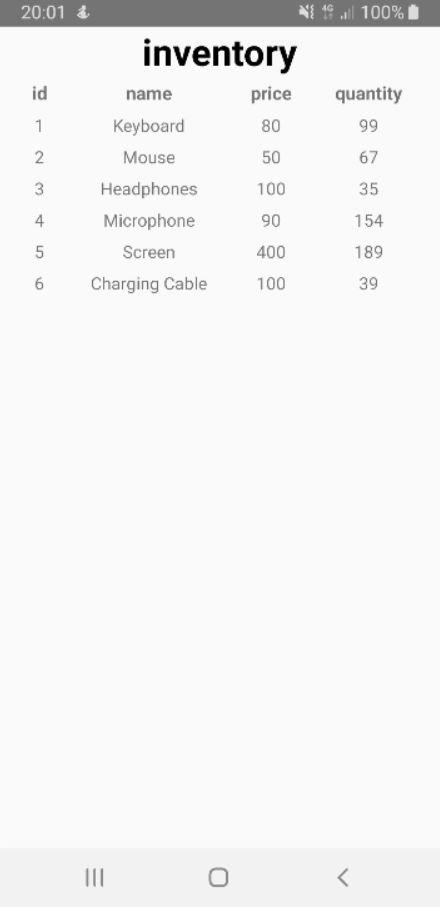
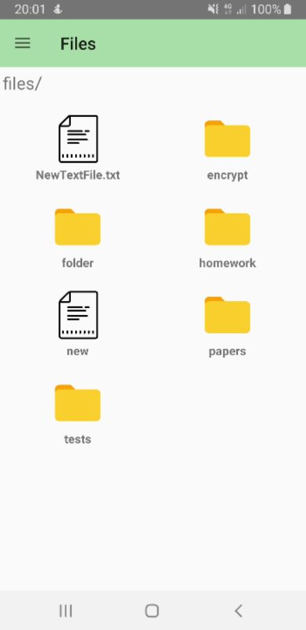
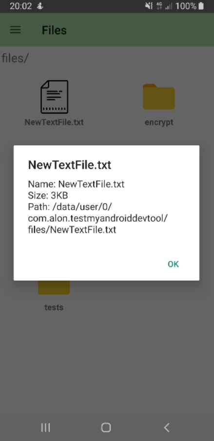
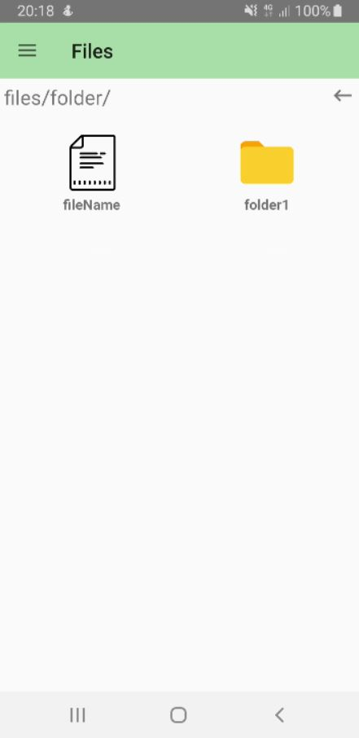

# AndroidDevTool

A library for easy debugging of the application's internal files, like: shared preferences files, SQLite databases and regular files.

## Usage
```java                    

Intent intent = new Intent("AndroidDevTool");
startActivity(intent);
```


## Features
### Shared Preferences
View, edit and delete the application's shared preferences files.
Clicking on one of the files will display this file's content.
There are 2 buttons for each file - one for editing the file, the other for deleting it.
<br>


<br><br>
### Databases
View the application's internal databases.
Clicking on one of the databases will open a list of all the tables that are stored in that database.
Clicking on one of the tables will display this table data.
<br>


<br><br>
### Files
View the folders and files in the application's internal storage.
Clicking on one of the folders will display this folder content.
Clicking on one of the files will display this file's information.
<br>



<br><br>

## Credit
Icons by Icons8.
